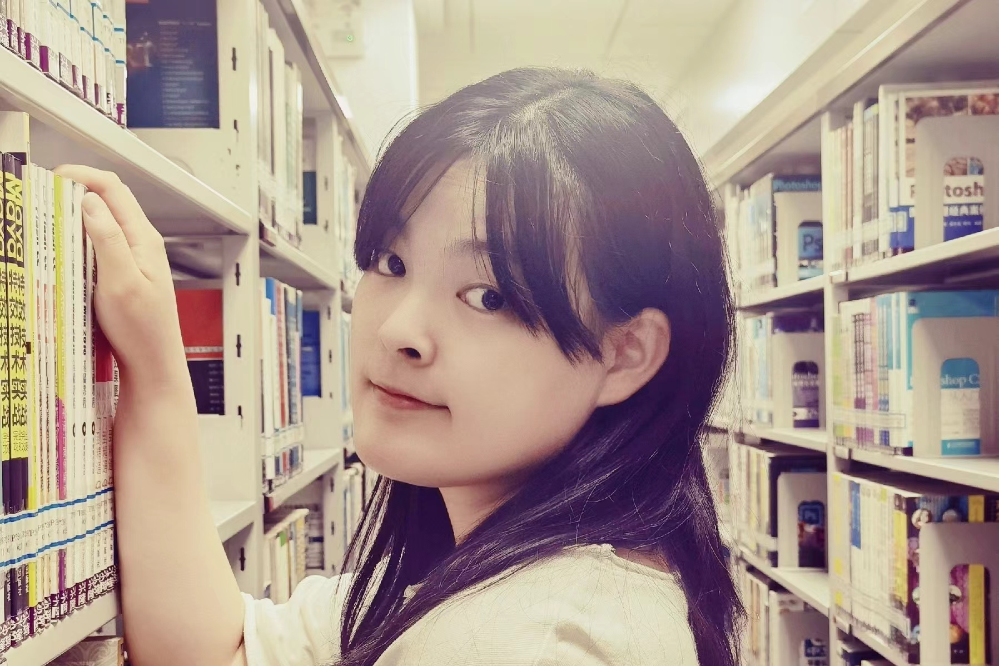

# Hi, 😊

 

I am Bing Du (杜冰), received the B.Eng. degree from Shandong University, Jinan, China, in 2021. [Prof. Shanzuo Lou]([http://faculty.nuaa.edu.cn/yang/zh_CN/index.htm](https://faculty.sdu.edu.cn/loushanzuo/zh_CN/index/523531/list/index.htm)) supervised my research on supply chain network design under uncertain environment. Now, I am looking for a graduate tutor.

 

Currently, I am looking for a graduate tutor. 

 

My research interests are primarily **Deep Learning**, **Medical Image Analysis**, and **Generative AI**. If you are also interested in these research directions and would like to chat, please feel free to email me (dubing22@163.com) or add my WeChat (DBBLLGLMSLTLGTM)! I am always happy to learn from brilliant minds ^_^!
 

## News and Updates

- **Dec 2023：** Awarded Outstanding Graduate of Guangdong University of Technology.
- **Sep 2022：** Obtained postgraduate promotion and exemption status and successfully entered Nanjing University of Aeronautics and Astronautics.
- **Sep 2021：** Joined MetaX Lab of Guangdong University of Technology, advised by [Prof. Jiawen Kang](https://teacher.gdut.edu.cn/kangjiawen/zh_CN/index.htm).

 

## Education and Work Background

- **Jul 2022 - Mar 2023:** China National Heavy Duty Truck Group Co., Ltd, Jinan, China      Control Strategy Engineer
- **Sep 2021 - Jan 2022:** Shandong University, Jinan, China      Administrative Assistant
- **Sep 2017 - June 2021:** Shandong University, Jinan, China      Undergraduate

